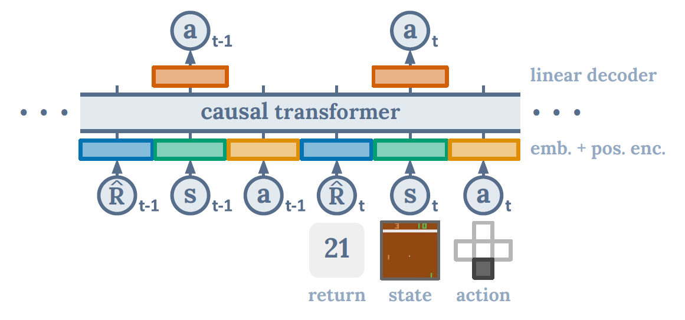
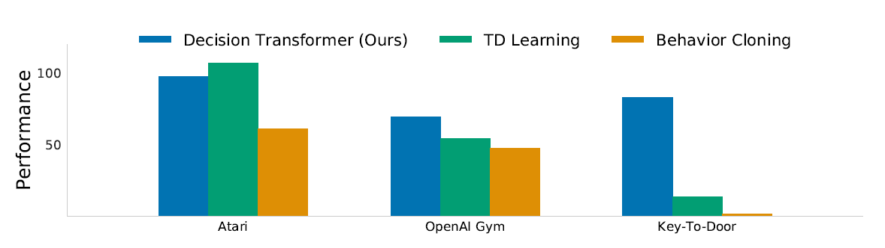
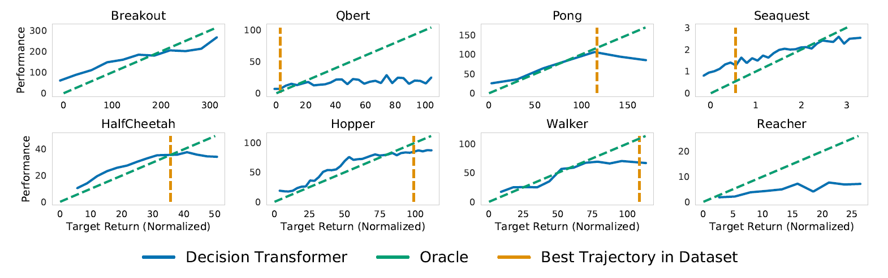
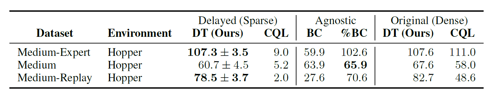

What if we treated reinforcement learning (RL) not as a problem of optimizing value functions or policies, but as a **sequence modeling task**—the same way we model text with GPT or BERT?  

That’s exactly the question behind **Decision Transformer (DT)**, introduced by [Chen et al. (2021)](https://arxiv.org/abs/2106.01345). Instead of computing policy gradients or fitting value functions, DT reframes RL as a *conditional sequence generation* problem.

---

## The Core Idea

Think about an RL trajectory: it’s just a sequence of **states, actions, and rewards**. DT reorganizes this into tokens:

(Return-to-go, State, Action, Return-to-go, State, Action, …)

A causal Transformer (like GPT) processes this sequence and predicts the **next action**, conditioned on:

- the past states and actions, and  
- a target return (the reward we *want* to achieve).  

So instead of asking “what action maximizes my Q-value?”, DT simply generates the next action as if it were “predicting the next word in a sentence.”

---

## Why Is This Interesting?

Traditional RL methods (like Q-learning or policy gradients) suffer from issues like:

- **Bootstrapping instability** (errors compound over time).  
- **Short-sightedness** due to reward discounting.  
- **Difficulty in sparse reward tasks** (credit assignment is hard).  

By contrast, DT leverages transformers’ ability to model **long-range dependencies** directly via self-attention. This makes it naturally suited to handle delayed rewards and diverse behavior distributions.

---

## Results

DT was evaluated on standard **offline RL benchmarks** where agents learn purely from logged trajectories (no new environment interaction):

- **Atari (discrete control)**  
  Despite training on just **1% of the DQN replay buffer**, DT matched or outperformed strong baselines like Conservative Q-Learning (CQL) in several games.  

- **OpenAI Gym / D4RL (continuous control)**  
  On locomotion tasks (HalfCheetah, Hopper, Walker) and a sparse-reward Reacher task, DT consistently reached or exceeded state-of-the-art scores.  

- **Long-term credit assignment**  
  In the **Key-to-Door** environment (where you must pick up a key early to unlock a door much later), DT succeeded where TD-learning algorithms struggled.  

---

## Why It Works

1. **Return conditioning = controllable behavior**  
   You can literally “prompt” the agent with a target return, similar to prompting GPT with a style or topic.  

2. **Context = policy identification**  
   Longer sequences let the model infer *which behavior policy* it’s imitating, improving predictions.  

3. **Generative modeling avoids pitfalls**  
   By not optimizing a brittle value function, DT avoids overestimation, pessimism tricks, and unstable bootstrapping.

---

## Discussion

The authors didn’t stop at benchmarks—they asked some of the obvious “skeptical” questions and ran experiments to probe them. Let’s walk through the main ones.

### 1. Isn’t this just behavior cloning on a subset of the data?
Good question! After all, if you condition on high returns, aren’t you just cloning the best trajectories?  

To test this, the authors introduced **Percentile Behavior Cloning (%BC)**: train a behavior cloning agent only on the top X% of episodes. In some cases, %BC can match DT—but only if you magically know which percentile to pick. DT, by contrast, uses *all* the data and still hones in on optimal behavior when conditioned on high returns. This makes DT much more practical.

---

### 2. Can DT actually model the distribution of returns?
Yes, Chen et al tested this by varying the desired RTG over a wide range and observing the DTs RTG. It can be seen that on every task, the desired target returns and the true observed returns are highly correlated. 

---

### 3. Does a longer context length help?
Yes. In RL, you might think that the current state (with frame stacking) is enough. But DT improves significantly when given longer histories (like 30–50 steps).  
Why? Because it’s not just modeling *one* policy—it’s modeling a *distribution of behaviors*. The longer context helps the transformer figure out “which policy this looks like,” which improves learning dynamics.

---

### 4. Does Decision Transformer perform effective long-term credit assignment?
To test whether DT can perform long-term credit assignment, they used the key-to-door environment. Where a binary reward is given only when the agent reaches the door in the 3rd room and finds the key in the first room. The success rates in the table show that DT demonstrates competitive performance to percentile behavior cloning, which is behavior cloning only trained on successful trajectories.

---

### 5. Can transformers be accurate critics in sparse reward settings?
Yes! The authors modified DT to predict returns in addition to actions. In sparse-reward tasks, the model’s attention naturally locked onto **key events** (like picking up the key or reaching the door). This suggests DT can not only act but also serve as an accurate value estimator.

---

### 6. Does Decision Transformer perform well in sparse reward settings?
Traditional TD-learning collapses when rewards are sparse. DT, however, didn't show a significant drop. In experiments where rewards were only given at the end of an episode (delayed return), DT still performed well—because its training objective doesn’t assume dense reward signals.

---

### 7. Why doesn’t DT need value pessimism or regularization?
Offline RL methods like CQL often rely on *value pessimism* to avoid overestimating unseen actions. DT sidesteps this because it doesn’t optimize against a learned value function—it just models trajectories. No need for extra regularization.

---

### 8. Can DT help in online RL?
Even though this work focused on offline RL, the implications for **online RL** are exciting. DT can act as a strong **behavior model** or “memory engine.” Combined with good exploration strategies, it could enable efficient online learning by generating high-quality trajectories on demand.

---

## Looking Forward

Decision Transformer shows that **large-scale sequence modeling** can serve as an *alternative paradigm* for RL.  

Some exciting future directions include:

- Pretraining DTs on huge offline datasets (just like GPT in language).  
- Extending return conditioning to distributions, not just single values.  
- Using DTs as powerful behavior models for **online RL**—acting as a “memory engine” while exploration modules handle novelty.  

In short: RL might not always need Bellman equations. Sometimes, it’s enough to just *predict the next token in the trajectory*.

---

## References

- Lili Chen, Kevin Lu, Aravind Rajeswaran, Kimin Lee, Aditya Grover, Michael Laskin, Pieter Abbeel, Aravind Srinivas, Igor Mordatch. *Decision Transformer: Reinforcement Learning via Sequence Modeling*. arXiv:2106.01345 (2021). [Paper Link](https://arxiv.org/abs/2106.01345)

